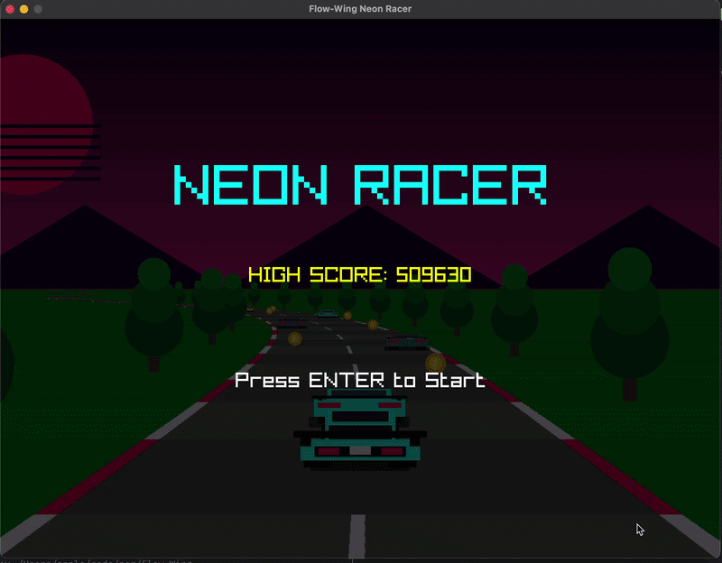
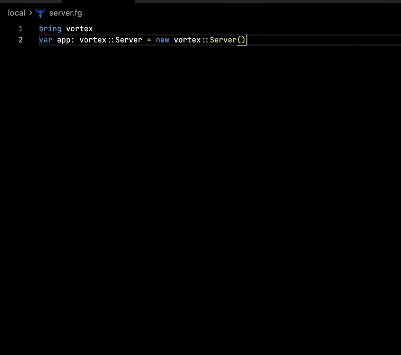
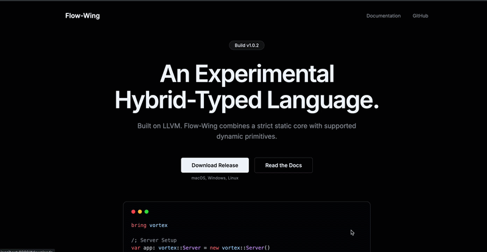

# Flow-Wing

Flow-Wing is an experimental, hybrid-typed programming language built on LLVM. It is designed to explore the combination of a strict static type system with supported dynamic primitives. 

Currently a work in progress, Flow-Wing supports object-oriented programming, automatic memory management (via Boehm GC), and modularity. It ships with both Ahead-of-Time (AOT) and Just-In-Time (JIT) compilers, alongside built-in modules for creating HTTP servers, building 2D/3D games, and handling standard I/O.

[Download Flow-Wing](https://flowwing.is-a.dev/) | [Official Documentation](https://flow-wing-docs.vercel.app/)

---

## 🎮 What can you build with Flow-Wing?

Flow-Wing is capable of building practical applications through its standard library and FFI bindings. Here are a few examples of what has been built using the language:

### 1. Games (via `raylib` module)
You can build 2D and 3D games natively by bringing in the `raylib` module. 


### 2. HTTP Servers (via `vortex` module)
Flow-Wing includes `Vortex`, an HTTP server framework for building APIs and serving web content.


### 3. Web Applications
The Flow-Wing website itself is served and powered by Flow-Wing.


---

## ✨ Key Features

* **Hybrid Typing:** Combines static types (`int`, `str`, `deci`) with a dynamic `dyn` type for flexibility when needed.
* **Dual Execution Modes:** Compile to native executables (AOT) or run scripts directly (JIT).
* **Memory Management:** Heap memory is managed automatically via the Boehm Garbage Collector. No manual `free()` required.
* **Object-Oriented:** Full support for classes, methods, inheritance (`extends`), and custom types.
* **Native C Interop:** Easily link external C/C++ libraries using standard linker flags (`-l`, `-L`).
* **Built-in Modules:** Ships with modules for file handling (`file`), JSON parsing (`json`), HTTP servers (`vortex`), graphics (`raylib`), and dynamic data structures (`vec`, `map`).

---


## 📚 Documentation

For a deep dive into the syntax, standard library modules, memory management, and compiler CLI flags, please refer to the comprehensive official documentation:

👉 **[Flow-Wing Documentation](https://flow-wing-docs.vercel.app/)**

---

## 🚀 Installation & Setup

The easiest way to get started is by using a prebuilt SDK, which includes the AOT compiler, the JIT runner, and the standard libraries.

### macOS (Apple Silicon)
Install via Homebrew:
```bash
brew tap kushagra1212/flowwing
brew install flowwing
```

### Windows & Linux
1. Visit the [GitHub Releases](https://github.com/kushagra1212/Flow-Wing/releases) page.
2. Download the installer or `.zip` SDK for your platform (`.exe` for Windows, `.deb` for Linux).
3. Ensure the `bin` directory is added to your system's `PATH`.

Verify your installation:
```bash
flowwing --version
flowwing-jit --version
```

---

## 🛠️ Language Examples

### Hello World
Create a file named `main.fg`:
```fg
fun fg_main() -> int {
    print("Hello, Flow-Wing!")
    return 0
}
```
**Run directly (JIT):**
```bash
flowwing-jit main.fg
```
**Compile to native binary (AOT):**
```bash
flowwing main.fg -o myapp
./myapp
```

### Object-Oriented Programming
Flow-Wing supports classes, inheritance, and constructors:

```fg
class Vehicle {
  var make: str
  var year: int

  init(make: str, year: int) -> nthg {
    self.make = make
    self.year = year
  }

  fun getDetails() -> str {
    return String(self.year) + " " + self.make
  }
}

class Car extends Vehicle {
  var doors: int
  
  init(make: str, year: int, doors: int) -> nthg {
    super(make, year)
    self.doors = doors
  }
}

var myCar: Car = new Car("Honda", 2022, 4)
println(myCar.getDetails())
```

### Creating an HTTP Server
Using the built-in `vortex` module to handle requests:

```fg
bring vortex
bring Err

fun fg_main() -> nthg {
  var app: vortex::Server = new vortex::Server()
  var err: Err::Result = app.listen(8080)
  
  if Err::isErr(err) {
    println("Failed to start: " + err.getMessage())
    return :
  }
  
  println("Server listening on port 8080...")
  
  while true {
    var req: vortex::Request, res: vortex::Response = app.accept()
    if req != null {
      if req.getMethod() == "GET" && req.getPath() == "/" {
        res.status(200).send("Hello from Vortex Server!")
      } else {
        res.status(404).send("Not found")
      }
    }
  }
}

fg_main()
```

---

## 🏗️ Building from Source (Local Build)

If you wish to contribute to the compiler or build the environment from scratch, you will need a C/C++ toolchain and Python 3. LLVM 17 is downloaded and built automatically by the make script.

**Prerequisites (macOS / Linux):**
```bash
# macOS
brew install automake autoconf libtool

# Linux (Ubuntu/Debian)
sudo apt-get install automake autoconf libtool
```

**Clone and Build:**
```bash
git clone https://github.com/kushagra1212/Flow-Wing.git
cd Flow-Wing

# Install dependencies (including LLVM)
make deps-install-debug

# Build the Ahead-Of-Time (AOT) compiler
make build-aot-debug

# Alternatively, build the Just-In-Time (JIT) compiler
make build-jit-debug
```

The compiled binaries will be staged at `build/sdk/bin/FlowWing`.

To run a file using your local build:
```bash
make run-aot-debug FILE=docs/demo/bird-game/bird.fg
```


*Flow-Wing is an ongoing experiment. Feedback, issue reports, and contributions are welcome.*
